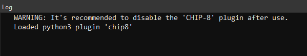
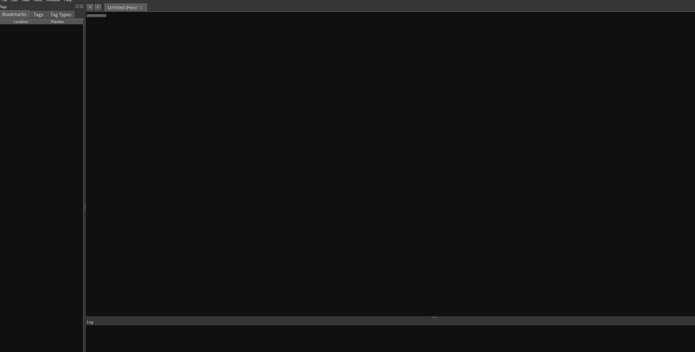

# BinaryNinja CHIP-8 Architecture plugin
Author: **uafio**

Load and disassemble CHIP-8 ROMs.
## Description:
_CHIP-8 is an interpreted programming language, developed by Joseph Weisbecker. It was initially used on the COSMAC VIP and Telmac 1800 8-bit microcomputers in the mid-1970s. CHIP-8 programs are run on a CHIP-8 virtual machine._

There are multiple implementations of the CHIP-8 Interpreter VM. This plugin works with what's known as [_CowGod's_](http://devernay.free.fr/hacks/chip8/C8TECH10.HTM) implementation.

Decided not to implement the interpreter data segment at virtual address 0-0x200 because I think the user will get confused when inspecting the image under the hexview. Besides, all of the ROMs I've seen use their own sprites located in the ROM data.

## Installation Instructions

### Manual Installation
Clone the repo in BinaryNinja's plugin directory

cd {binary_ninja_dir}/plugins && git clone https://github.com/uafio/BinaryNinja-CHIP8-Arch.git chip8

Start BinaryNinja. You should see the following message in the log console.

### Plugin Manager
TODO

## Required Dependencies

Package is self-contained, it requires no additional packages.

## License

This plugin is released under a MIT license.

## Preview

